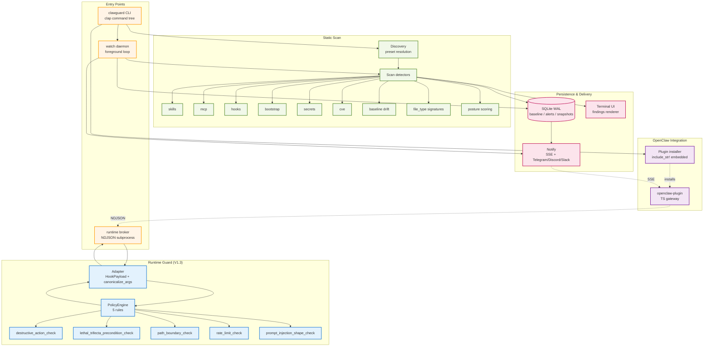

# ClawGuard Architecture

> Auto-generated from the GitNexus knowledge graph (repo `claw`, 9034 symbols / 15169 relationships / 300 execution flows). Regenerate with `/mcp__gitnexus__generate_map` after major refactors.

## Overview

ClawGuard is a single-binary Rust security scanner + runtime guard for OpenClaw-class AI agent runtimes. Two operating modes share one codebase:

- **Static scan** (V0 / V1 / V1.1 / V1.2) — detectors fan out over filesystem artifacts (skills, MCP configs, hooks, bootstrap, secrets), produce `Finding` structs, render to terminal + JSON.
- **Runtime guard** (V1.3 Sprint 2) — an NDJSON broker subprocess brokered by an OpenClaw plugin; each tool call is canonicalized, run through a 5-rule `PolicyEngine`, and either allowed / warned / suspected / blocked.

Everything else — daemon watch loop, SSE fan-out, posture scoring, baseline drift detection, trust/approve state machine — is glue on top of those two primitives.

## Functional Areas

Ranked by symbol count (non-test clusters). Cohesion from GitNexus community detection.

| Module | Symbols | Cohesion | Role |
|---|---|---|---|
| **Scan** | 214 | 72% | Stateless detectors: skills, MCP, hooks, bootstrap, secrets, CVE, baseline, file-type signatures, posture scoring |
| **Cli** | 68 | 65% | `clap` command tree: scan, watch, stats, audit, alerts, trust, baseline, notify, policy, plugin, posture, runtime broker |
| **Policy** | 66 | 83% | Runtime rule engine: destructive-action / lethal-trifecta / path-boundary / rate-limit / prompt-injection-shape |
| **Notify** | 44 | 82% | Alert delivery — SSE server, Telegram/Discord/Slack routing, recent-alert cache, dedup |
| **Adapter** | 32 | 76% | Runtime adapter layer — NDJSON broker, OpenClaw `HookPayload` shape, `canonicalize_args` pipeline |
| **Plugin** | 23 | 97% | One-shot OpenClaw plugin installer (`include_str!`-embedded), symlink-safe writes, `plugin status` probing |
| **Daemon** | 17 | 77% | `watch` foreground loop — polling + drift alerts + notification routing + debouncing |
| **State** | 15 | 77% | SQLite (WAL): baseline records, scan snapshots, alerts, receipts, posture snapshots |
| **Discovery** | 10 | 63% | OpenClaw / Claude Code / Codex preset discovery from `~/.openclaw` etc. |
| **Ui** | 7 | 86% | Terminal findings renderer |
| **Openclaw-plugin** | 7 | 100% | TS gateway plugin source (SSE → Telegram bridge) |
| **Wizard** | 6 | 78% | Interactive first-run wizard |
| **Config** | 5 | 100% | `~/.clawguard/` config store |

Tests cluster (733 symbols, 78%) is excluded from the runtime picture but pins every public contract above.

## Key Execution Flows

Top 5 ranked by cross-module reach (from `gitnexus://repo/claw/processes`).

### 1. Static scan entry point — `main → DiscoveryReport`

```
main (src/main.rs)
  → run (src/cli/mod.rs)
  → run_scan_command (src/cli/mod.rs)
  → run_scan_flow (src/cli/mod.rs)
  → discover_from_builtin_presets (src/discovery/mod.rs)
  → DiscoveryReport (src/discovery/mod.rs)
```

Kicked by `clawguard scan`. Discovery picks runtime presets (OpenClaw / Claude Code / Codex / Custom), then scan fans out detectors over the discovered roots.

### 2. Watch daemon startup — `run_watch_command → clawguard_dir_for_home`

```
run_watch_command (src/cli/mod.rs)
  → load_saved_config_for_operational_command (src/cli/mod.rs)
  → load_config (src/config/store.rs)
  → config_path → config_path_for_home → clawguard_dir_for_home
```

Mirrored by `run_trust_command`, `run_posture_command`, `run_baseline_approve_command`, `run_notify_update_command` — all operational CLI commands share this config-loading preamble.

### 3. Runtime guard block path — `dispatch_blocks_rm_rf_with_block_reason → hex_value`

```
dispatch (src/runtime/adapter/openclaw.rs)            # NDJSON broker dispatcher
  → event_to_payload (src/runtime/adapter/openclaw.rs)
  → canonicalize_args (src/runtime/adapter/common.rs)  # NFKC + zero-width strip + percent-decode + whitespace collapse, fixed-point
  → canonicalize_once
  → percent_decode_once
  → hex_value
```

The happy-path runtime block flow. `canonicalize_args` is the **choke point** — Sprint 2 §7 fuzzer caught a non-idempotent percent-decode here (`5%5%4545 → 5^45`); fix was the fixed-point loop bounded by `MAX_CANONICALIZE_PASSES = 8`.

### 4. Prompt-injection detection — `prompt_injection_shape_check → hex_value`

```
evaluate_post (src/runtime/policy/rules.rs)           # post-tool-call policy pass
  → prompt_injection_shape_check
  → canonicalize_args
  → canonicalize_once → percent_decode_once → hex_value
```

Tool *results* — not just commands — go through the same canonicalizer. Weighted substring / regex score for instruction-override, role-override, system-prompt-exfil, format-token injection, zero-width obfuscation. `Suspect` at score ≥ threshold.

### 5. Rate-limit ring buffer — `rate_limit_check_trips_on_excess_destructive`

```
rate_limit_check (src/runtime/policy/rules.rs)
  → session ring buffer → count destructive-class calls in window
  → canonicalize_args → strip_matching_quotes
```

Per-session stateful — N destructive calls in M seconds trips `runtime-rate-limit-exceeded` (Medium, ASI02). Isolation between sessions pinned by `BYPASS-05` regression test.

## Mermaid Architecture Diagram



## Design Invariants

- **Single binary, zero-config by default** — preset-driven discovery of OpenClaw / Claude Code / Codex.
- **Findings are structured first, rendered second** — one `Finding` model → JSON + terminal.
- **Alert-by-default, no real-time blocking in V1 static scan** — block only at the runtime layer (V1.3 Sprint 2 `PolicyEngine`).
- **Canonicalize-once + fixed-point** — all runtime input flows through `canonicalize_args`; it converges to a fixed point (bounded by `MAX_CANONICALIZE_PASSES = 8`) to close percent-encoding + NFKC recomposition bypass chains.
- **Byte-first file-type detection** — skills/hooks/mcp detectors check file magic bytes *before* `fs::read_to_string` so a disguised binary (`.md` extension, ELF contents) trips `file-type-mismatch` instead of crashing the text pipeline.
- **Adapter always fails open on panic** — `catch_unwind` around every policy call, stderr marker `clawguard-adapter-panic`; the runtime never blocks the user because of a ClawGuard bug.
- **TOFU baseline + explicit approve** — first-seen artifacts are recorded; drift requires human approval via `clawguard trust` / `clawguard baseline approve`.

## Navigation

| You want to… | Use |
|---|---|
| Explore a concept | `gitnexus_query({query: "prompt injection"})` |
| See all callers of a fn | `gitnexus_context({name: "canonicalize_args"})` |
| Measure change blast radius | `gitnexus_impact({target: "fn", direction: "upstream"})` |
| Verify commit scope | `gitnexus_detect_changes()` |
| Trace a specific flow | Read `gitnexus://repo/claw/process/{name}` |

## Regenerating This Doc

```
/mcp__gitnexus__generate_map
```

Run after any Sprint-scale refactor so the clusters + processes stay honest.
